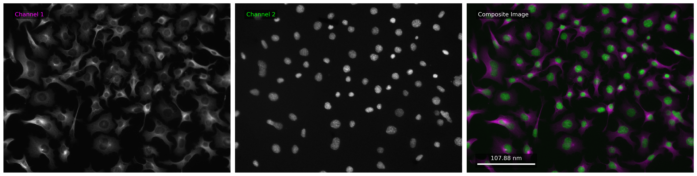

# Lookup Table in Python (LUTiPy)

LUTiPy is a Python package designed for creating aesthetically pleasing composite images from fluorescent microscopy data using complementary lookup tables (LUTs). This package simplifies the process of generating visually enhanced images for publication, presentation, or analysis.

---

## Features

- **Preset and Custom LUTs**: Apply prebuilt or custom LUTs to microscopy images.
- **Composite Images**: Combine channels with complementary colors to produce clear and visually appealing images.
- **Scalebars and Annotations**: Add scalebars and annotations for better image understanding.
- **Flexible Layouts**: Customize image layouts (e.g., horizontal, vertical).
- **User-Friendly API**: Intuitive methods to process and save images.

---

## Installation

Install LUTiPy using the repository:

```bash
git clone https://github.com/rkarmaka/lutipy.git
cd lutipy
pip install -e .
```

---

## Requirements

LUTiPy requires the following dependencies:

- `numpy`
- `matplotlib`

You can install the requirements via:

```bash
pip install -r requirements.txt
```

---

## Usage

Below is a quick start example to demonstrate the package's functionality:

### Example Code

```python
from lutipy.core import LUTiPy
import lutipy.data as data

# Load example data
image = data.cells()

# Create a LUTiPy object with a horizontal layout and a scalebar
lutipy = LUTiPy(
    layout="horizontal",
    scalebar=True,
    pixel_size="0.31 nm",
    scale_length=0.25
)

# Process the image
lutipy.process_image(image)

# Save the processed image
lutipy.save_figure("out.png")
```

### Output

After running the above script, the processed image will be saved as `out.png` in the working directory.



---

## Functionality

### 1. Create a LUTiPy Object
Customize the layout, scalebar, and other parameters:
show_box_background=True,

**Parameters:**

```rgb (tuple)```: Custom color for the first channel. *Default: magenta (255, 0, 255)*

```layout (str)```: Specifies the arrangement of images. ```horizontal```, ```vertical``` & ```grid```.

```channel_names (list)```: Channel names mentioned on the image. *Default: None - adds names as Channel 1, Channel 2, ...*

```scalebar (bool)```: Determines whether to include a scalebar in the image. *Default: False*

```scale_length (float)```: Percentage of the image with scalebar length (between 0.1-0.9). *Default: 0.25*

```pixel_size (str)```: Pixel size in the form of a string {value} {unit}. *Default: None*

```scalebar_position (str)```: Position of the scalebar on the frame. *Default: "bottom-left"*

```name_position (str)```: Position of the channel name on the frame. *Default: "top-left"*

```show_box_background (bool)```: Add black background with 50% transparency to the name and scalebar box. *Default: True*


### 2. Process Image
Pass a single image or a list of images to be processed:

```python
lutipy.process_image(image)
```

### 3. Save Processed Image
Export the final image to your desired file format:

```python
lutipy.save_figure("output_file.png")
```

---

## Contributing

Contributions are welcome! To contribute:

1. Fork the repository.
2. Create a new branch for your feature or bugfix.
3. Submit a pull request with a detailed explanation of your changes.

---

## License

This project is licensed under the terms of the [LICENSE](LICENSE) file.
