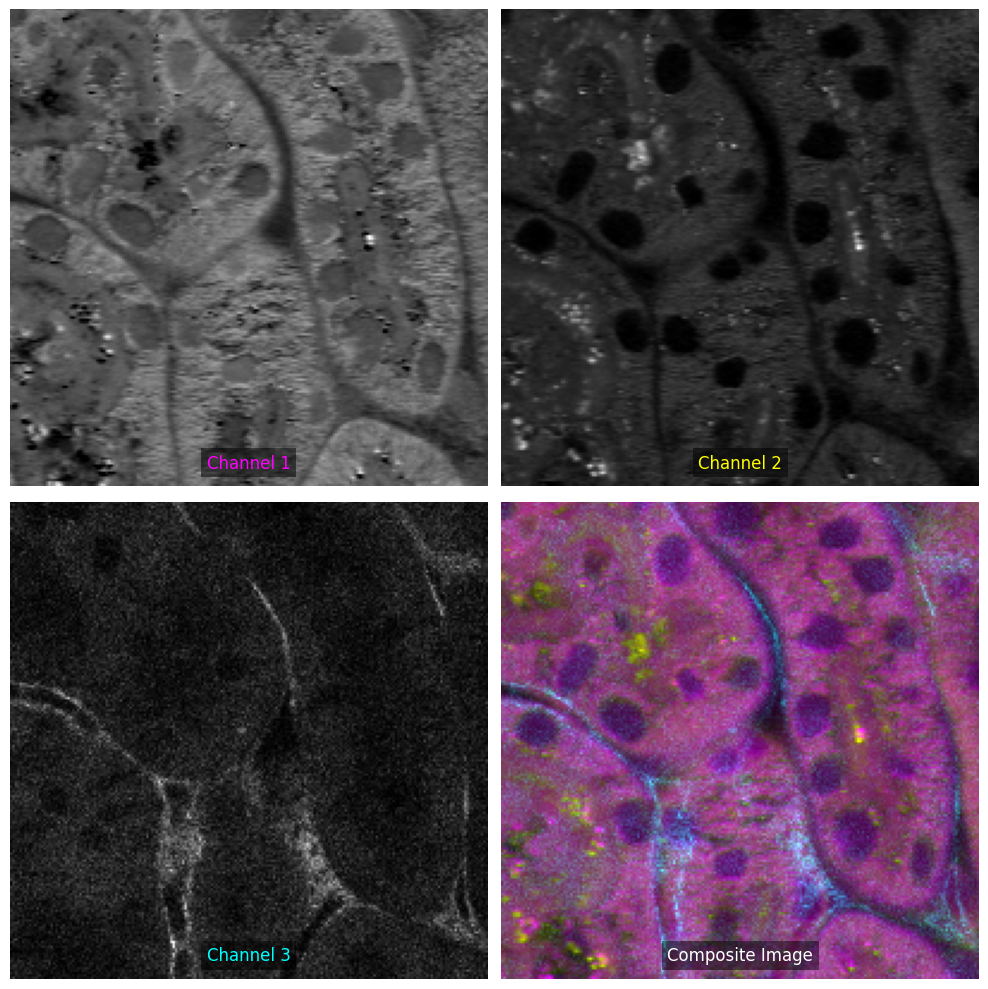

# Lookup Table in Python (LUTiPy)
LUTiPy is a Python package for creating aesthetically pleasing composite images from fluorescent microscopy data using complementary LUTs.

## Features
- Apply preset or custom LUTs to microscopy images.
- Create composite images with complementary colors.

## Usage
```python
import tifffile as tiff
from lutipy.core import LUTiPy, ImageProcessor


image = tiff.imread(f"assets/cells_1.tif")
image = ImageProcessor.convert_to_channel_last(image)

lutipy = LUTiPy(channel_names=["Protein", "Lipid"], layout="horizontal")
lutipy.process_image(image)
```

<!--  -->
